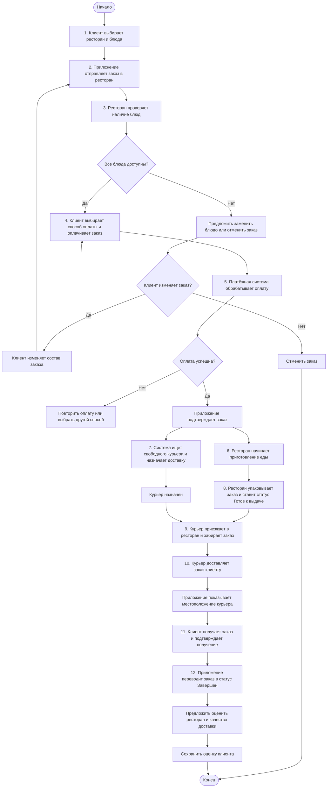

# Flowchart

```mermaid
flowchart TD
    A([Начало]) --> B["1. Клиент выбирает ресторан и блюда"]
    B --> C["2. Приложение отправляет заказ в ресторан"]
    C --> D["3. Ресторан проверяет наличие блюд"]

    D --> E{"Все блюда доступны?"}

    E -->|Нет| F["Предложить заменить блюдо или отменить заказ"]
    F --> G{"Клиент изменяет заказ?"}

    G -->|Да| H["Клиент изменяет состав заказа"]
    H --> C

    G -->|Нет| I["Отменить заказ"]
    I --> Z([Конец])

    E -->|Да| J["4. Клиент выбирает способ оплаты и оплачивает заказ"]
    J --> K["5. Платёжная система обрабатывает оплату"]

    K --> L{"Оплата успешна?"}

    L -->|Нет| M["Повторить оплату или выбрать другой способ"]
    M --> J

    L -->|Да| N["Приложение подтверждает заказ"]

    N --> O["6. Ресторан начинает приготовление еды"]
    N --> P["7. Система ищет свободного курьера и назначает доставку"]

    O --> Q["8. Ресторан упаковывает заказ и ставит статус Готов к выдаче"]
    P --> R["Курьер назначен"]

    Q --> S["9. Курьер приезжает в ресторан и забирает заказ"]
    R --> S

    S --> T["10. Курьер доставляет заказ клиенту"]
    T --> U["Приложение показывает местоположение курьера"]
    U --> V["11. Клиент получает заказ и подтверждает получение"]
    V --> W["12. Приложение переводит заказ в статус Завершён"]
    W --> X["Предложить оценить ресторан и качество доставки"]
    X --> Y["Сохранить оценку клиента"]
    Y --> Z([Конец])
```